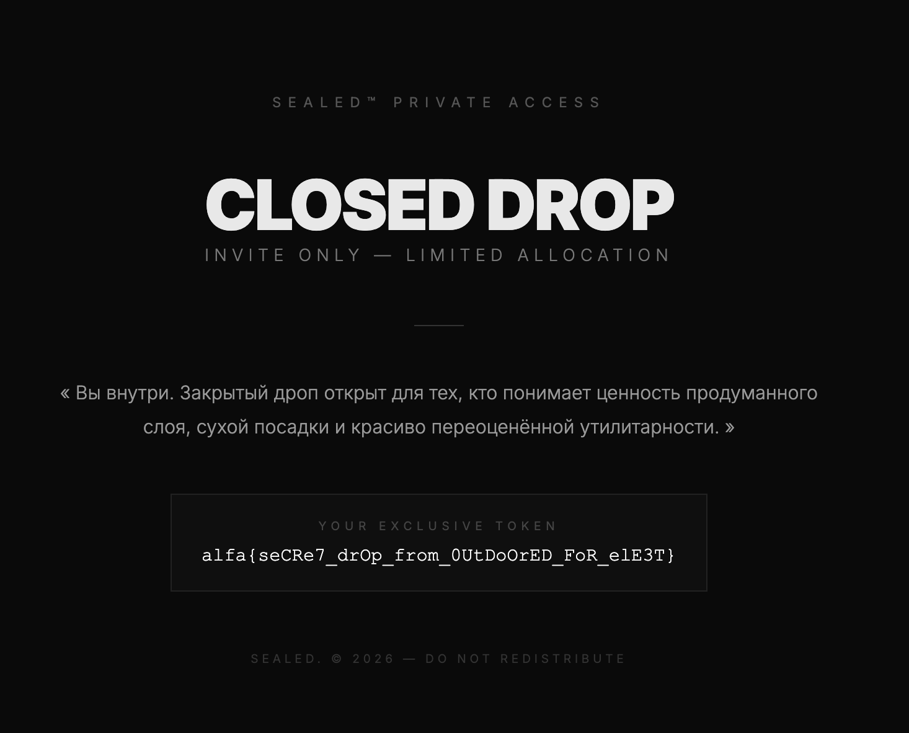

# Закрытый дроп

- **Slug:** `sealed`
- **Уровень:** Сложные
- **Теги:** Hard, Forensics, iOS, Reverse, Crypto
- **Автор:** Владимир Волков ([@v1ru55](https://t.me/v1ru55)), [SPbCTF](https://t.me/spbctf)
- **Исходная страница:** https://alfactf.ru/tasks/sealed
- **Flag:** `alfa{seCRe7_drOp_from_0UtDoOrED_FoR_elE3T}`

## Условие

> Культовый аутдор-бренд решил, что обычные промокоды недостаточно элитарны, поэтому для избранных клиентов, партнёров и прочих апостолов мембраны разослал специальные айфоны с собственным сверхзащищённым приложением.
>
> Через это приложение открывались закрытые дропы, персональные скидки и, вероятно, чувство морального превосходства над людьми в обычных худи. Никаких рассылок, никаких скриншотов, ссылкой не поделиться — только эксклюзивный доступ, шифрование данных и несколько слоёв маркетингово-оправданной криптографии.
>
> Один из этих телефонов обронили на фестивале спешелти-кофе. Конкуренты быстро прикарманили устройство и успели снять только частичный дамп, прежде чем телефон удалённо заблокировали.
>
> Теперь ваша задача — восстановить данные и получить доступ к новому дропу.

Дано: `SEALED_DUMP.tar.zst` — частичный дамп iOS-устройства.

## TL;DR

Расшифровать `sync_state.dat` приложения **DeviceVault** на чужом iPhone без самого iPhone:

1. Реверс Swift-бинаря `DeviceVault.app/DeviceVault` (ARM64) → восстанавливаем крипточейн.
2. Достаём из дампа все 7 device-идентификаторов: `UDID`, `SerialNumber`, `UniqueChipID`, `IMEI`, `WifiAddress`, `BluetoothAddress`, `ICCID` + 32-байтовый `keychain_secret` (он удобно лежит файлом на диске) + `Weather data container UUID`.
3. Воспроизводим алгоритм:
   ```
   password = HMAC-SHA256(SHA256(UDID‖Serial‖ECID‖IMEI), WIFI‖BLUETOOTH‖ICCID)
   salt     = SHA256(keychain_secret ‖ weather_uuid)
   pbkdf    = PBKDF2-HMAC-SHA256(password, salt, 10007, 32)
   aes_key  = HMAC-SHA256(pbkdf, "com.devicevault.app.v1\x01")     # HKDF-Expand, L=32, один блок
   plain    = AES-GCM-256.decrypt(aes_key, blob[:12], blob[12:], aad=None)
   ```
4. В plaintext — JSON со ссылкой на закрытый дроп. Ходим по ссылке → HTML-страница с флагом.

## Анализ

### Структура дампа

```
private/var/containers/Bundle/Application/28D38E49-…/DeviceVault.app/DeviceVault   # бинарь
private/var/mobile/Containers/Data/Application/03E00EEB-…/Documents/sync_state.dat # 228 B AES-GCM
private/var/mobile/Containers/Data/Application/03E00EEB-…/Library/Caches/
                                              com.apple.sync.device                # 32 B keychain cache
private/var/wireless/Library/Preferences/com.apple.commcenter.plist                # ICCID, IMEI
private/var/preferences/SystemConfiguration/NetworkInterfaces.plist                # WifiAddress
private/var/hardware/FactoryData/…                                                 # UDID, Serial, ECID, BT MAC
```

`sync_state.dat` ровно 228 байт = `12 (nonce) + 200 (ct) + 16 (tag)` — классический CryptoKit AES-GCM combined layout.

### Реверс DeviceVault

Бинарь — Swift 5.x, `cryptid=0`, импортирует `CryptoKit`, `Security`, `Foundation`, `UIKit`. Радаром (`r2 -A`) находим master-функцию `0x10000b184`:

```
bl readHardwareComponents     → 4 строки: UDID, Serial, ECID(hex), IMEI
bl readNetworkComponents      → 2 строки: WifiAddress, BluetoothAddress
bl readICCID                  → 1 строка: ICCID
bl readSysAppUUID             → 1 строка: data container UUID com.apple.weather
bl loadOrCreateKeychainSecret → 32 байта секрета
bl func_10000658c             → salt builder
bl func_100006e3c             → SHA256(keychain ‖ weather_uuid) password builder
bl func_1000077c4             → PBKDF2 wrapper (читает iter из config.plist)
bl func_100008838             → post-PBKDF (HKDF-Expand с info из config.plist)
bl AESGCM.open                → расшифровка
```

#### XOR-обфусцированные строки

В `__DATA` лежит 16 строк, обфусцированных XOR-ом с ключом `[0x42, 0x13, 0x77, 0x25]`. Формат: `length(QW) ‖ capacity(QW) ‖ obfuscated_bytes`. Декодер — [`solve/decode_xor_blobs.py`](solve/decode_xor_blobs.py):

| VA | Длина | Расшифровка |
|---|---|---|
| `0x1000257a8` | 14 | `UniqueDeviceID` |
| `0x1000257e0` | 12 | `SerialNumber` |
| `0x100025818` | 12 | `UniqueChipID` |
| `0x100025850` | 36 | `InternationalMobileEquipmentIdentity` |
| `0x1000258a0` |  7 | `%016llX` (формат для ECID) |
| `0x1000258f8` | 11 | `WifiAddress` |
| `0x100025930` | 16 | `BluetoothAddress` |
| `0x100025990` |  5 | `ICCID` |
| `0x1000259f8` | 22 | `LSApplicationWorkspace` |
| `0x100025a38` | 16 | `defaultWorkspace` |
| `0x100025a70` | 24 | `allInstalledApplications` |
| `0x100025ab0` | 21 | `applicationIdentifier` |
| `0x100025af0` | 16 | `dataContainerURL` |
| `0x100025b28` | 17 | `com.apple.weather` |
| `0x100025b78` | 14 | `schema_version` |
| `0x100025bb0` | 12 | `vault_suffix` |
| `0x100025bf0` | 14 | `com.apple.sync` |
| `0x100025c28` |  6 | `device` |

Ключевые открытия:
- `LSApplicationWorkspace` — приватное API (используется в `readSysAppUUID`).
- Bundle ID для lookup'а — **`com.apple.weather`**, а не `com.devicevault.app`. Привязка идёт к контейнеру системного приложения «Погода».
- `schema_version`/`vault_suffix` — ключи в `config.plist` рядом с бинарём (`DeviceVault.app/config.plist`).
- `com.apple.sync` + `device` — имя файла-кэша keychain-секрета.

#### loadOrCreateKeychainSecret — секрет на диске

`func_100008d50` читает запись из keychain (`SecItemCopyMatching`) **и параллельно дублирует 32 байта в файл** через `Foundation.Data.write(to: URL)` по пути `Library/Caches/com.apple.sync.device`. Это позволяет обойти keybag: в дампе есть готовый файл, и расшифровка `keychain-2.db` не нужна.

```bash
$ xxd .../Library/Caches/com.apple.sync.device
00000000: 7acf d7d4 f197 fa41 4792 4279 4e97 7948
00000010: 33f7 065c af48 c803 6615 e552 925c 7c67
```

#### Iter count = 10007 (детерминированный)

`func_1000077c4` — обёртка над `CCKeyDerivationPBKDF`:
- `kCCPBKDF2 = 2`, `kCCPRFHmacAlgSHA256 = 3`, `derivedKeyLen = 0x20`.
- Iter читается из `config.plist` по ключу `schema_version`. Файл есть в дампе:
  ```xml
  <key>schema_version</key><integer>10007</integer>
  <key>vault_suffix</key><string>.v1</string>
  ```

#### Post-PBKDF transform = HKDF-Expand

`func_100008838` строит `info`-строку: грузит `vault_suffix` (= `.v1`) из `config.plist` и аппендит к константе `com.devicevault.app` → `com.devicevault.app.v1`. Затем вызывает `func_100007b44(prk, info_data, L=0x20)`.

`func_100007b44` — стандартный HKDF-Expand: цикл `T(i) = HMAC(prk, T(i-1) ‖ info ‖ counter)`. Для `L=32` достаточно одной итерации, поэтому:
```python
aes_key = hmac_sha256(pbkdf, b"com.devicevault.app.v1" + b"\x01")
```

### Hardware-идентификаторы из дампа

| Поле | Значение | Источник |
|---|---|---|
| UDID | `818f51114fe9694e93b02e8ddb3534e3e71d9ec0` | mobileactivationd `UniqueDeviceCertificate` |
| SerialNumber | `C8PWL460JWF7` | mobileactivationd UDC |
| UniqueChipID (ECID) | `000C28403808E02E` | FactoryData/UDC, `%016llX` от int64 |
| IMEI | `352989095784185` | `com.apple.commcenter.device_specific_nobackup.plist` |
| WifiAddress | `647033b23730` | `NetworkInterfaces.plist` en0, нормализованный (lowercase, no colons) |
| BluetoothAddress | `64:70:33:B2:70:DC` | FactoryData, нормализованный (uppercase, with colons) |
| ICCID | `8997103124066584148` | `commcenter.plist` `LastKnownICCID` |
| Weather UUID | `2E3D73AC-3BBE-476A-9CFF-70D323D9ED27` | data container `com.apple.weather` |

> **Тонкость нормализации.** Внутри `readNetworkComponents` (`func_100005210`) первый MAC обрабатывается как `String.replacingOccurrences(":","").lowercased()`, второй — `String.uppercased()` (двоеточия сохраняются). Поэтому WiFi идёт без двоеточий в нижнем регистре, а Bluetooth — с двоеточиями в верхнем.

## Решение

### Главная ловушка: порядок аргументов PBKDF2

Команда несколько суток стучалась в стену с моделью:
```
password = SHA256(keychain ‖ weather_uuid)
salt     = HMAC-SHA256(SHA256(HW), NW1‖NW2‖ICCID)
pbkdf    = PBKDF2(password, salt, 10007, 32)
```

22+ миллиона AES-GCM попыток — все мимо. Корректная интерпретация: **Swift-обёртка `func_1000077c4` принимает `arg1=password, arg2=salt`, а master передаёт первым аргументом результат salt-builder'а**. То есть переменные надо поменять местами:

```python
# результат HMAC от HW/NW идёт как PASSWORD в PBKDF2
pbkdf_password = hmac.new(hw_hash, network_blob, sha256).digest()
# результат SHA256 от keychain/weather идёт как SALT в PBKDF2
pbkdf_salt     = sha256(keychain_secret + weather_uuid).digest()
pbkdf          = pbkdf2_hmac("sha256", pbkdf_password, pbkdf_salt, 10007, 32)
```

С точки зрения семантики PBKDF2 это абсолютно эквивалентно (оба — 32 байта высокой энтропии), но порядок принципиально разный для финального ключа. Достаточно было перестать гипотезировать "что является password, что является salt" и просто следовать прототипу `CCKeyDerivationPBKDF`.

### Финальный solver

[`solve/solve.py`](solve/solve.py):

```python
import hashlib, hmac, json
from cryptography.hazmat.primitives.ciphers.aead import AESGCM

UDID, SERIAL, ECID, IMEI = (
    "818f51114fe9694e93b02e8ddb3534e3e71d9ec0",
    "C8PWL460JWF7",
    "000C28403808E02E",
    "352989095784185",
)
WIFI, BLUETOOTH, ICCID = (
    "647033b23730", "64:70:33:B2:70:DC", "8997103124066584148",
)
WEATHER_UUID = "2E3D73AC-3BBE-476A-9CFF-70D323D9ED27"
BUNDLE_ID, VAULT_SUFFIX, ITER = "com.devicevault.app", ".v1", 10007

secret = open("Library/Caches/com.apple.sync.device", "rb").read()      # 32 B
hw     = hashlib.sha256((UDID + SERIAL + ECID + IMEI).encode()).digest()
net    = (WIFI + BLUETOOTH + ICCID).encode()

password = hmac.new(hw, net, hashlib.sha256).digest()
salt     = hashlib.sha256(secret + WEATHER_UUID.encode()).digest()
pbkdf    = hashlib.pbkdf2_hmac("sha256", password, salt, ITER, 32)
key      = hmac.new(pbkdf, (BUNDLE_ID + VAULT_SUFFIX).encode() + b"\x01",
                    hashlib.sha256).digest()

blob = open("Documents/sync_state.dat", "rb").read()
plain = AESGCM(key).decrypt(blob[:12], blob[12:], None)
print(json.loads(plain))
```

### Plaintext

```json
{
  "v": 1,
  "entries": [
    {
      "id": "259AA489-96FA-47AA-A9EB-F6458D1B2FCE",
      "label": "Link",
      "secret": "https://sealed-fzb3w9tr.alfactf.ru/drop?code=321ca343f2972fdfcfbea5d6c21f355f",
      "created_at": 1774870195.255075
    }
  ]
}
```

GET по `secret` URL отдаёт HTML-страницу закрытого дропа с флагом в качестве «эксклюзивного токена»:



```
alfa{seCRe7_drOp_from_0UtDoOrED_FoR_elE3T}
```

## Уроки задачи

1. **Не гадать про роль `Data`-аргументов в Swift-обёртках над C-API.** При реверсе Swift-кода смотрите ВСЕГДА на сигнатуру C-функции (`CCKeyDerivationPBKDF`), а не на семантику переменных в обёртке. `arg1` обёртки → `password` C-функции, `arg2` обёртки → `salt`. Точка.
2. **Маркетингово-оправданная криптография имеет смысл.** PBKDF2 + HKDF-Expand + AES-GCM с привязкой к hardware fingerprint реально не позволяет угнать дроп без устройства — все идентификаторы пришлось вытаскивать из forensic-дампа.
3. **Keychain не всегда нужен.** Разработчик DeviceVault ради удобства бэкапит секрет в `Library/Caches/`. Это разрушает всю модель безопасности на холодном дампе: keybag и UID-ключ SoC становятся не нужны.
4. **iPhone 6s vs iPhone 12.** В FactoryData дампа есть данные обоих поколений (decoy), но реальное устройство — iPhone 6s (`Model = D201AP`, `ChipID = 0x8010`). Это видно по `lockdownd.log` и UDC.

## Файлы

- [`solve/solve.py`](solve/solve.py) — финальный декриптор + fetch URL'а
- [`solve/decode_xor_blobs.py`](solve/decode_xor_blobs.py) — XOR-деобфускатор строк бинаря
